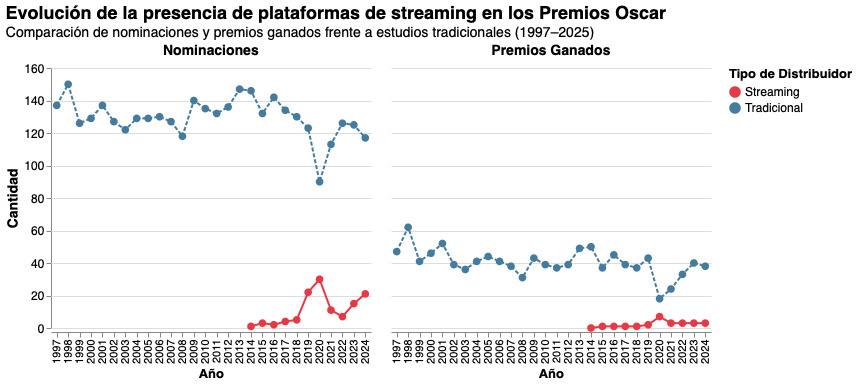

## Crónica

Desde su primera edición en mayo de 1929, los Premios Óscar se han consolidado como el principal referente de la temporada de premios cinematográficos, destacando anualmente el trabajo de quienes forman parte de la industria del cine. A lo largo de casi un siglo, productoras y distribuidoras emblemáticas como Walt Disney Productions, Warner Bros. y Metro-Goldwyn-Mayer han liderado este escenario, marcando la pauta cinematográfica año tras año.

Sin embargo, en la última década, una transformación significativa ha alterado este panorama. Las plataformas de streaming, encabezadas por Netflix, Amazon Studios y Apple TV+, han emergido como actores dominantes en la industria, no solo en términos de producción y distribución, sino también en la obtención de reconocimientos durante la temporada de premios.

La visualización de datos desarrollada, que analiza las nominaciones y premios de los Óscar entre 1997 y 2025, evidencia esta tendencia: las películas distribuidas por plataformas de streaming han incrementado su presencia y éxito en los premios.

Un ejemplo destacado es el de Netflix en los Óscar de 2021. La plataforma obtuvo 36 nominaciones, la mayor cantidad para cualquier distribuidor ese año, incluyendo dos candidaturas a Mejor Película: "Mank" y "The Trial of the Chicago 7". Aunque no logró obtener los premios principales, este logro subraya su influencia creciente en la industria.

Este fenómeno está estrechamente ligado al auge del modelo OTT (Over the Top), que permite la distribución de contenido audiovisual a través de internet, sin necesidad de los canales tradicionales como la televisión por cable o las salas de cine. Estas plataformas ofrecen acceso 24/7, permiten consumir contenido en múltiples dispositivos y, mediante membresías, representan una forma legal y flexible de acceder a una larga oferta medial. Su capacidad para generar recomendaciones personalizadas a través de algoritmos basados en análisis de comportamiento ha transformado radicalmente las prácticas de consumo, especialmente en audiencias móviles.

El impacto de las OTT no se limita al público. También ha comenzado a transformar el modo en que se predicen y comprenden los premios. Un estudio publicado por la plataforma digital y base de datos Science Direct publicado en 2021 explora cómo el análisis de redes sociales y el aprendizaje automático pueden predecir a los ganadores del Óscar con cierto grado de precisión. Al analizar el comportamiento y las opiniones de los usuarios, los investigadores concluyen que el “ruido social” y las tendencias digitales podrían ser indicadores fiables de reconocimiento en la industria. La popularidad en línea, entonces, se convierte en una variable tan poderosa como las decisiones de la crítica o los votos académicos.

Hoy, una película no necesita una gran sala ni una alfombra roja para aspirar al máximo reconocimiento. Puede ser vista en un celular, en un tren o en una sala de estar. Lo importante ya no es el formato, sino el impacto. Y en ese nuevo ecosistema digital, las plataformas de streaming llegaron para quedarse.

+ https://www.sciencedirect.com/science/article/abs/pii/S1875952121000380
+ https://elearning.unite.it/pluginfile.php/217240/mod_resource/content/2/5.%20Reading%204%20-%20Oscars%202021_%20Netflix.pdf
+ https://bibliotecadigital.uchile.cl/discovery/fulldisplay?docid=alma991007536456903936&context=L&vid=56UDC_INST:56UDC_INST&lang=es&adaptor=Local%20Search%20Engine&tab=Everything&query=sub,contains,derecho%20de%20autor,AND&sortby=date_d&facet=rtype,include,books&mode=advanced&offset=0